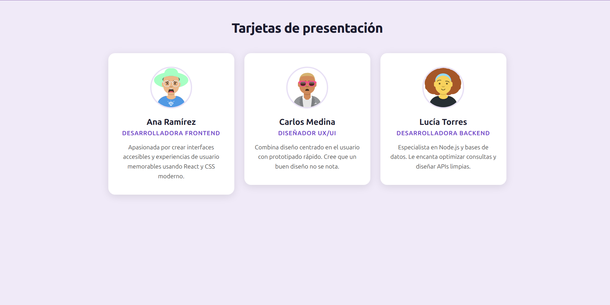

# react-tarjetas-utn-fullstack

# ⚛️ Tarjetas de Presentación — React Inicial

**Curso:** React Inicial — Centro de e-Learning UTN BA  
**Módulo:** 1 — Unidad 4  
**Autor:** Facundo Rodriguez

---

## 📸 Capturas de pantalla



---

## 📋 Descripción

Aplicación React desarrollada con Vite como entrega del módulo "React Inicial". Implementa un componente funcional `Tarjeta` que recibe por props el nombre, profesión, imagen y descripción de una persona, y lo reutiliza tres veces en `App.jsx` con datos distintos. Aplica JSX con buenas prácticas (etiquetas cerradas, `alt` descriptivo en imágenes), estilos con CSS externo y diseño responsivo: las tarjetas se muestran en fila en pantallas grandes y apiladas en dispositivos móviles.

---

## 🚀 Cómo clonar e iniciar el proyecto

```bash
# 1. Clonar el repositorio
git clone https://github.com/FARO1993/modulo-1-tarea-4-utn-fullstack.git

# 2. Ingresar a la carpeta
cd modulo-1-tarea-4-utn-fullstack

# 3. Instalar dependencias
npm install

# 4. Iniciar el servidor de desarrollo
npm run dev
```

Abrí el navegador en `http://localhost:5173` (o el puerto que indique Vite en la terminal).

---

## 📁 Estructura del proyecto

```
modulo-1-tarea-4-utn-fullstack/
├── index.html
├── package.json
├── vite.config.js
└── src/
    ├── main.jsx
    ├── index.css
    ├── App.jsx
    └── components/
        ├── Tarjeta.jsx
        └── Tarjeta.css
```

---

## 📚 Bibliografía y créditos

**Imágenes:** Avatares generados con [DiceBear Avataaars](https://www.dicebear.com/) — licencia CC0 (dominio público).

**Referencias:**
- Banks, A. y Porcello, E. *Learning React: Modern Patterns for Developing React Apps*. 2ª ed. O'Reilly Media, 2020.
- Freeman, E. y Robson, E. *Head First JavaScript Programming*. 1ª ed. Estados Unidos: O'Reilly Media, 2014.
- MDN Web Docs. *``: The Image Embed element*. Mozilla Corporation. https://developer.mozilla.org/en-US/docs/Web/HTML/Element/img
- React. *Writing Markup with JSX*. https://react.dev/learn/writing-markup-with-jsx
- React. *Passing Props to a Component*. https://react.dev/learn/passing-props-to-a-component
- Anthropic. Claude (modelo de inteligencia artificial). Utilizado como asistente para la generación y revisión del código de este proyecto. https://www.anthropic.com
